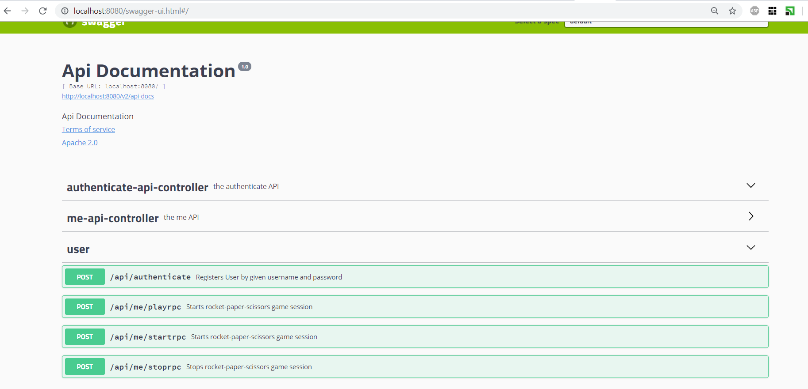
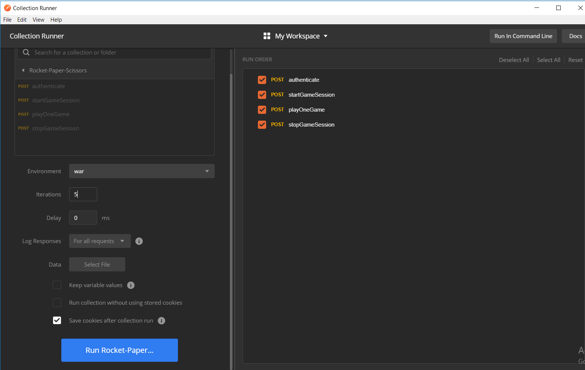
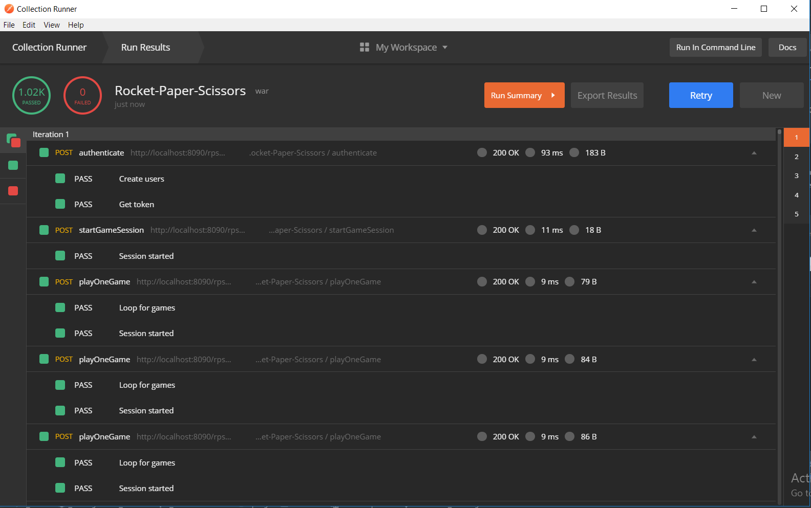
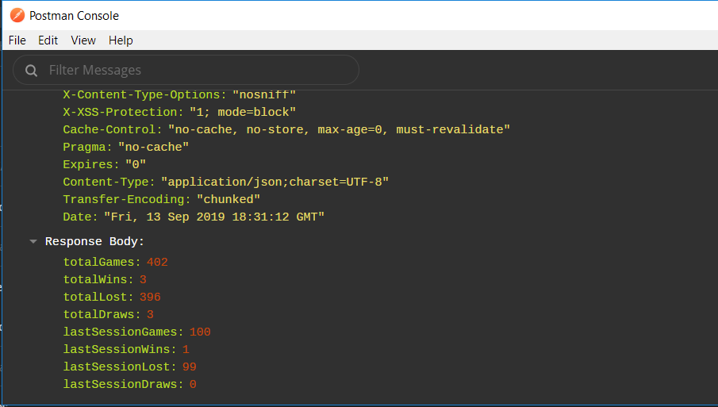
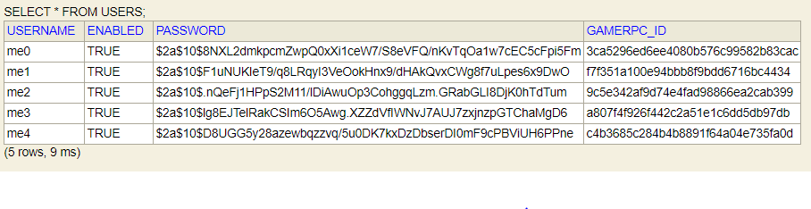
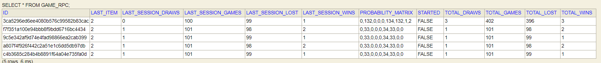

# Rocket-Paper-Scissors game API

This project provides API to authenticate, start, play and stop rocket-paper-scissors game.
Also it tries to foresee gamer's next move and exploit it.

## How we try to exploit gamer's pseudo random items generation.
Initial idea behind this is quite simple - we will count all transitions from, let's say Rocket, to any other item including Rocket (gamer can show Rocket two times in a row) and store last item from gamer.

That would be such matrix:

              Rocket    Paper    Scissors
      Rocket     3        9         1
      Paper      8        3         4
      Scissors   1        2         7

For example if latest item from gamer was a Rocket then it is likely that next item will be Paper (max number among Rocket row).
Having said that we should show Scissors (which beats Paper).
After each game we increment value at matrix[Rocket][Paper] (if last was Paper).

This is very basic step towards winning against human. But gamer can change strategies with time. In this case we should introduce kind of forgetting all previous statistics. In math all this transitions are called a Markov's chain.

## Algorithm implementation details.
Implementation of the algorithm is quite straight forward. Just would like to say that this matrix is stored as concatenation of all numbers in a String.
Theoretically it would be a separate table with game id, row id, column id and value. We should have 9 rows per one game (or per one gamer). Having 1M users would result in 9M rows in the table.
Storing them in one String simplifies things.

## Infrastructure details.
### Swagger
I use swagger for API documentation:

 
To explore and try them you would go to http://<server>/swagger-ui.html.

### Swagger code generation.
I use codegen library provided by Swagger to generate whole Controller and DTO level.
*generate.bat* script is used to do it. You will need to download *swagger-codegen-cli.jar*.
Templates for generation are in *resources/templates/codegen*

This approach I find very useful from two years using it. It prevents you from spending time for a lot of boilerplate code. Also excludes such layer from any mistake. You just need to write it once as a template.

### H2 In Memory Database.
I use H2 db to simplify stuff and have a good performance. We will not need to install any other persistent database. But after restart you will loose all the data.
Users are added during authentication process.

## Testing. 
For testing I used Postman collection scripts and API testing facilities. We need to set *base* environment variable which represents server url (http://localhost:8090/rps-0.0.1-SNAPSHOT).


I imitated gamer round-robin item pick. Maximum that gamer can win in that case first 4 rounds:

```javascript
    if (gameNumber > 4) {
        var jsonData = pm.response.json();
        pm.expect(jsonData.result).to.eql("COMPUTER_WON");
    }
```
I used 5 iterations (1 iteration is for one user) and 100 games inside each iteration:

As you can see ALL games which number is greater than 4 won by computer:

Statistics after 100 games for particular user:


In database we have all users with games:


  
  
  
